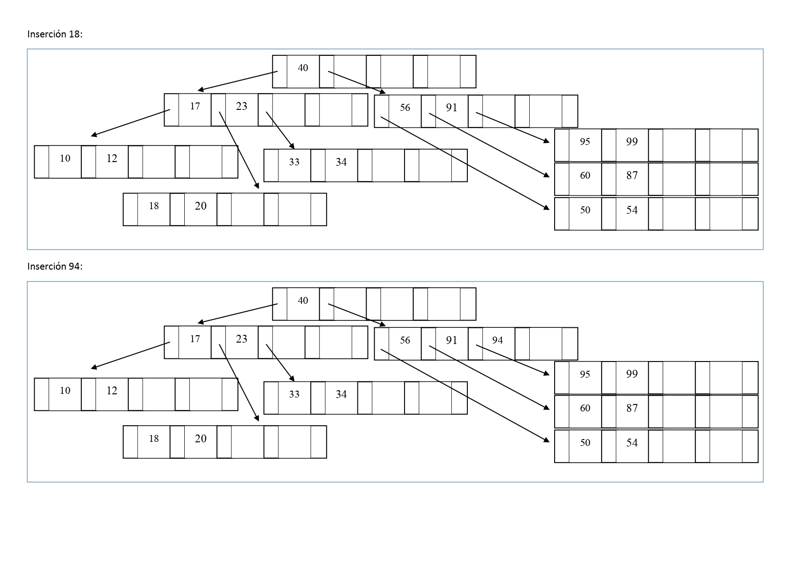

14.	Inserte los siguientes datos en un árbol-B, de grado 2. 
Los números que se dan como datos pueden representar datos más complejos (objetos). Dibuje el árbol a medida que sufra cambios en su estructura como consecuencia de la inserción.
Insertar: 
95 - 10 - 34 - 87 - 56 - 99 - 12 - 23 - 50 - 40 - 60 - 54 - 33 - 20 - 91 - 17 - 18 - 94

