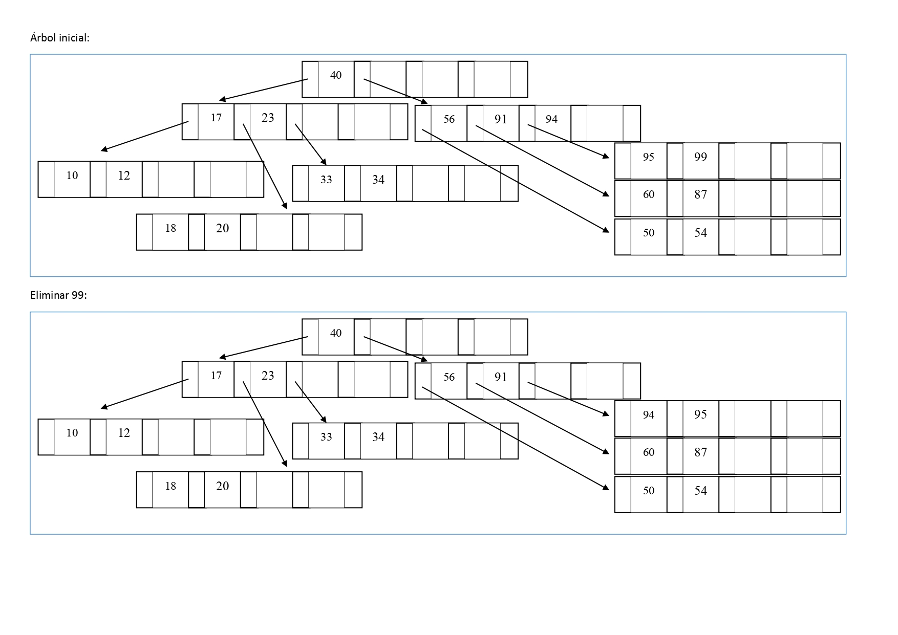
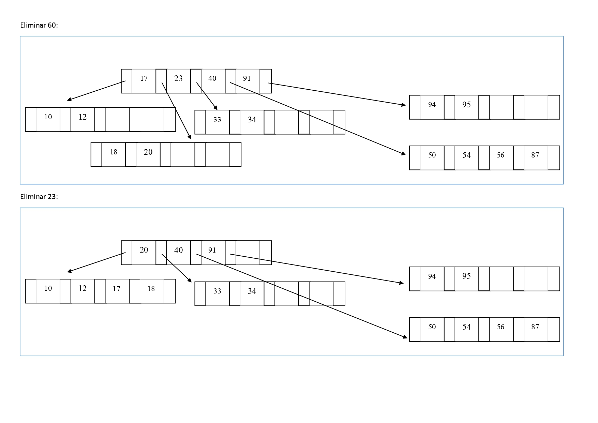
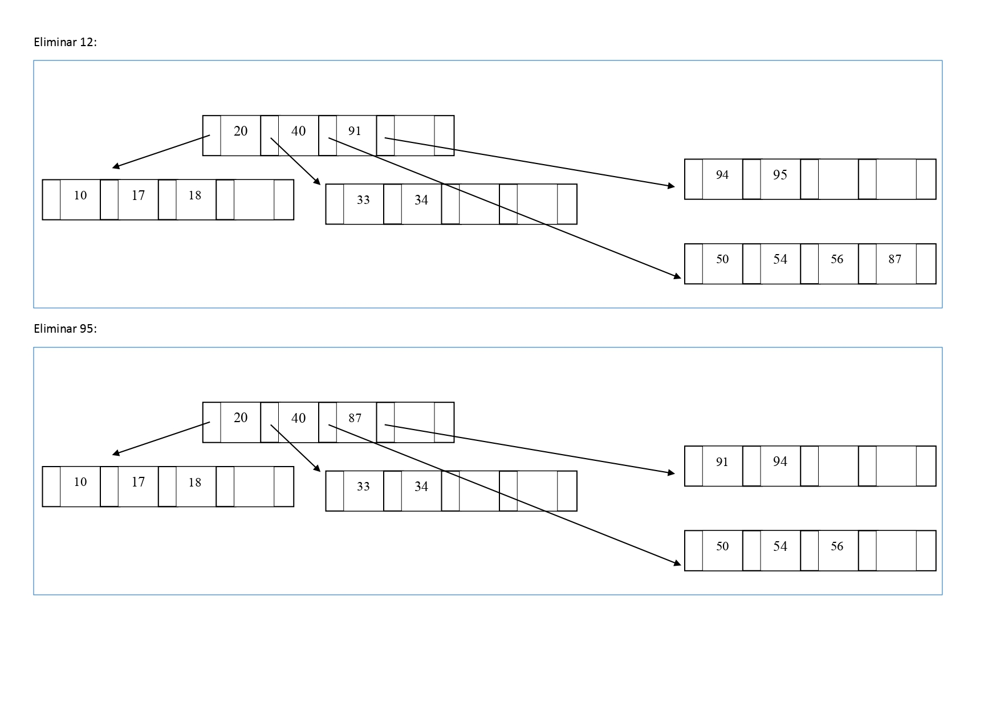
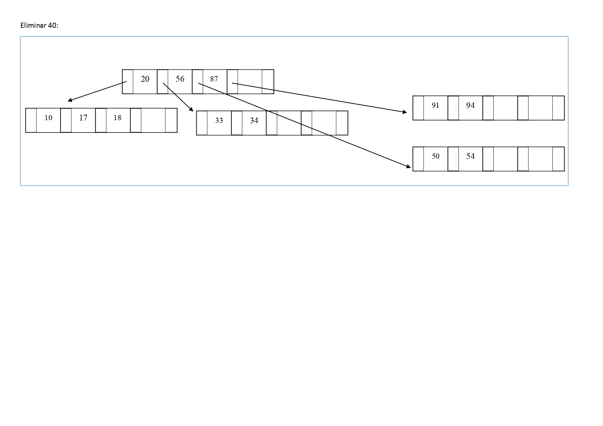

15.	En el árbol-B generado en el problema anterior elimine los datos que se señalan a continuación.
Dibuje el árbol a medida que sufra cambios en su estructura como consecuencia de la eliminación.
Eliminar: 99 - 60 - 23 - 12 - 95 - 40

