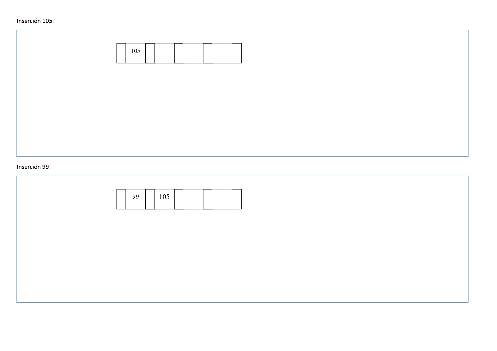
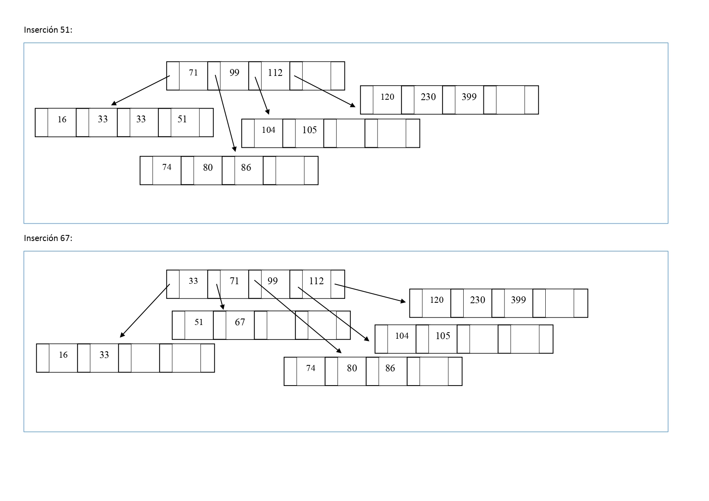

16.	Inserte los siguientes datos en un árbol-B, de grado 2. 
Los números que se dan como datos pueden representar datos más complejos (objetos). Dibuje el árbol a medida que sufra cambios en su estructura como consecuencia de la inserción.
Insertar: 
105 - 99 - 104 - 80 - 16 - 74 - 112 - 230 - 71 - 33 - 86 - 399 - 33 - 120 - 51 - 67 - 90 - 84 - 45 - 405 - 257 - 110

