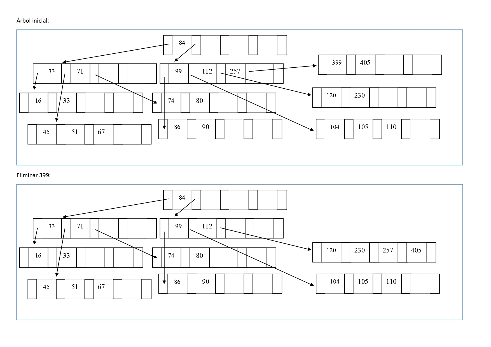
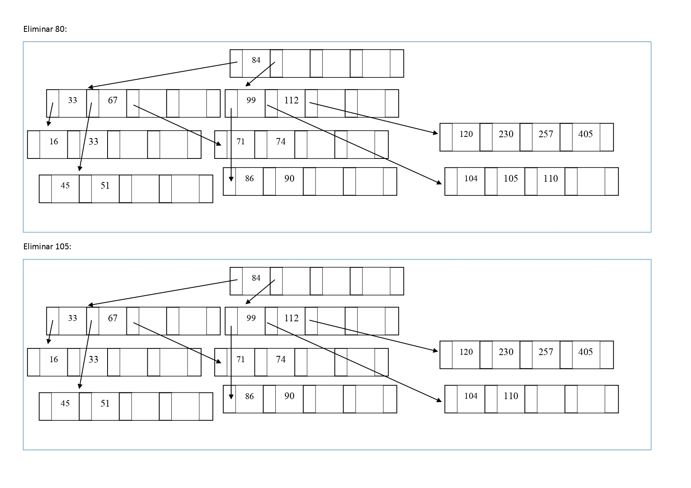
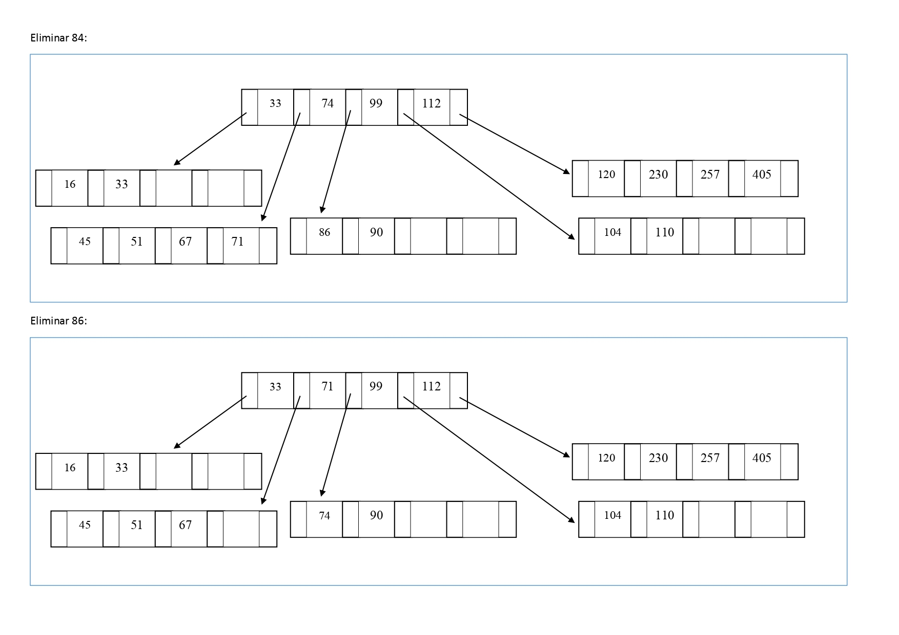
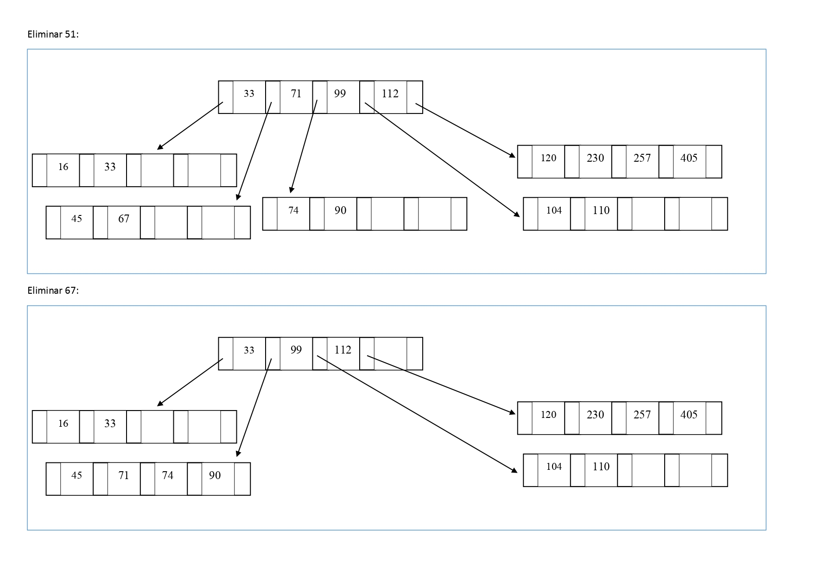
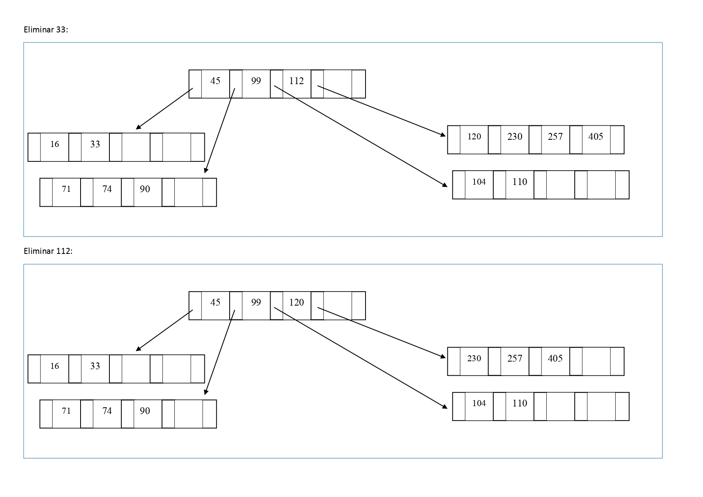
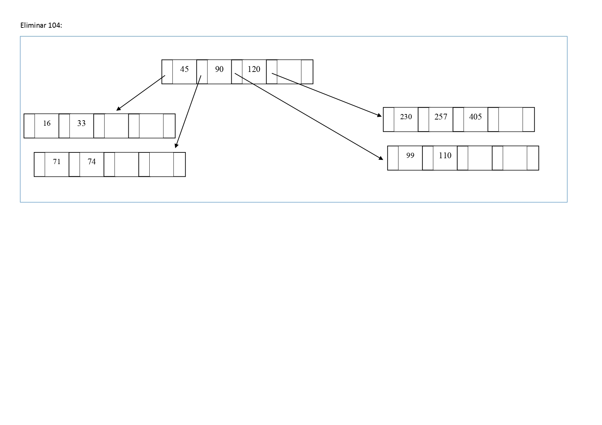

17.	En el árbol-B generado en el problema anterior elimine los datos que se señalan a continuación.
Dibuje el árbol a medida que sufra cambios en su estructura como consecuencia de la eliminación.
Eliminar: 399 - 80 - 105 - 84 - 86 - 51 - 67 - 33 - 112 - 104

