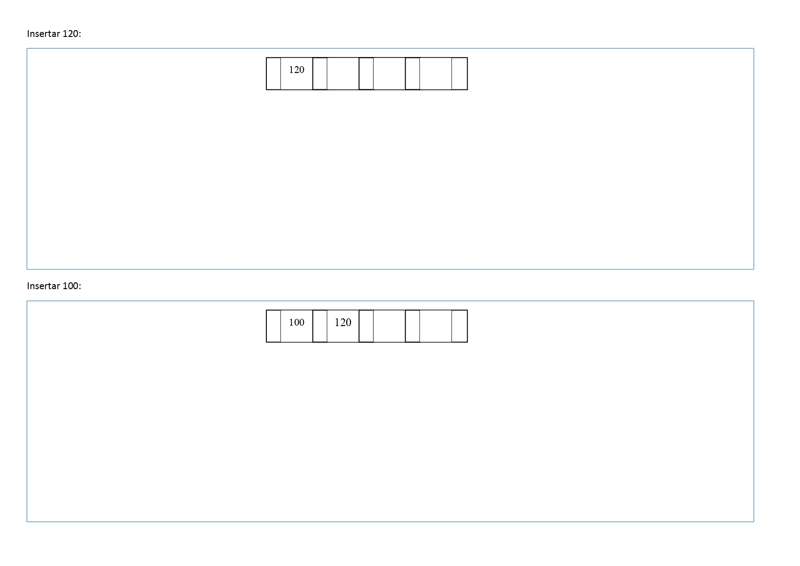
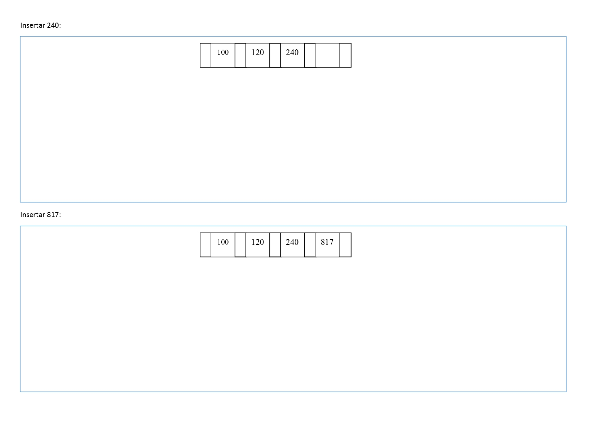
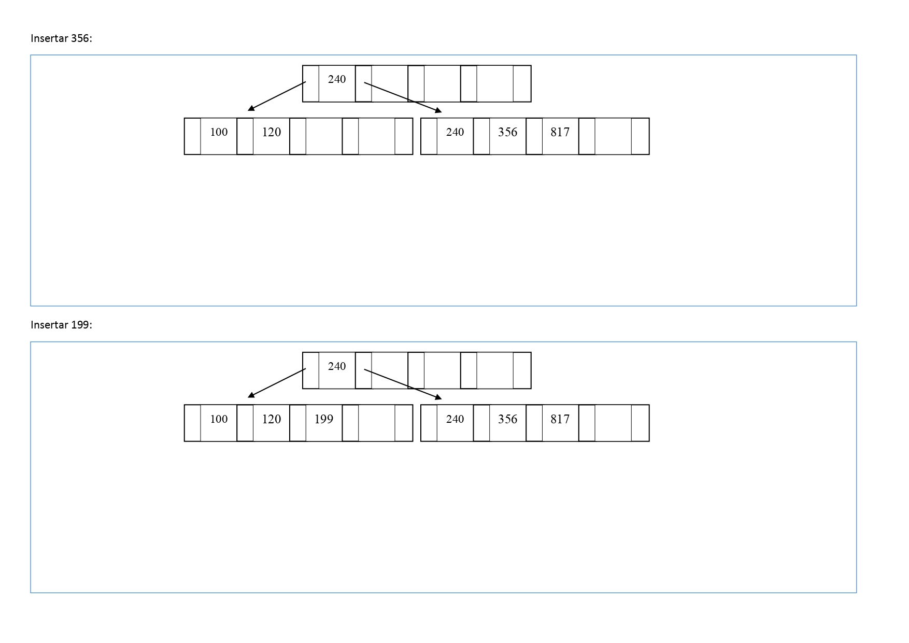
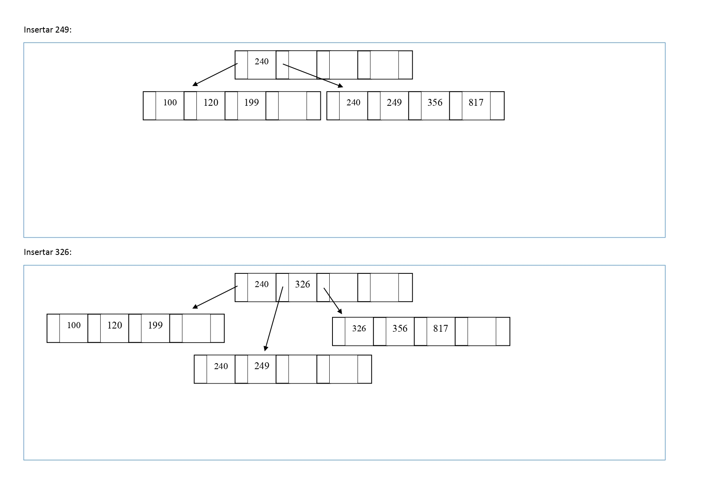
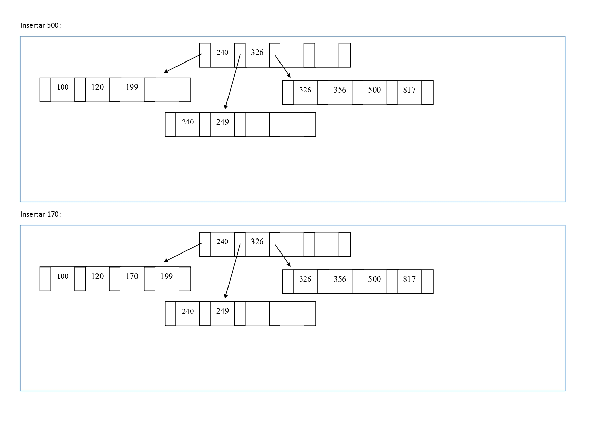
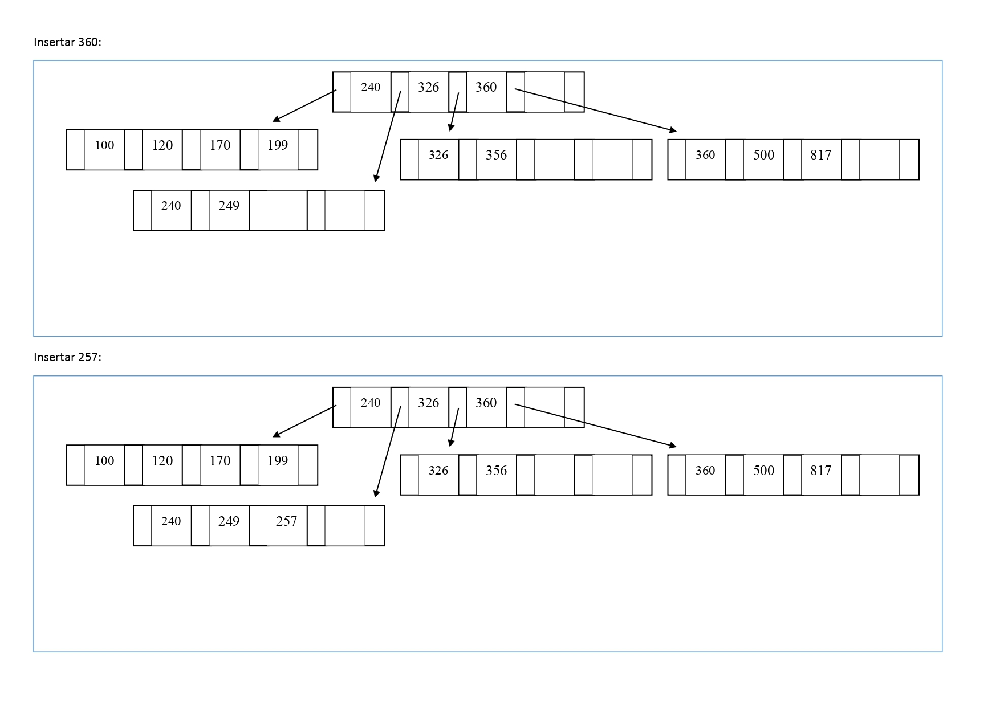
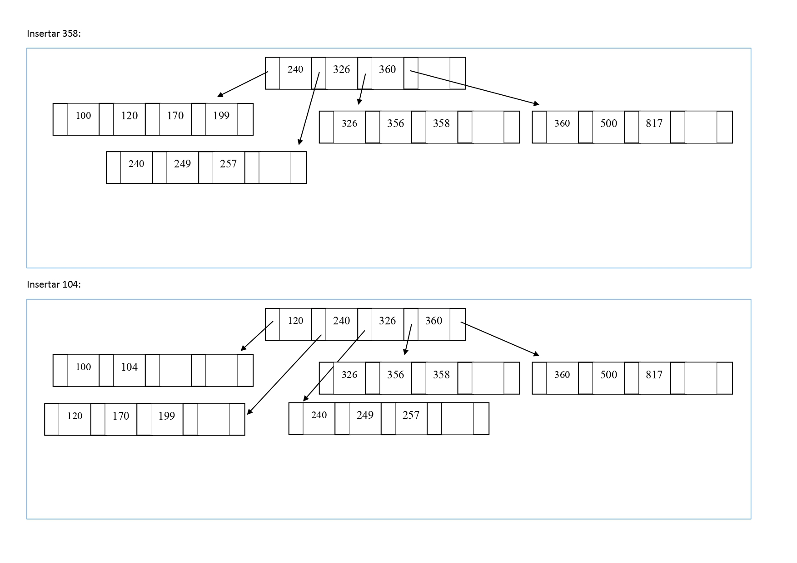
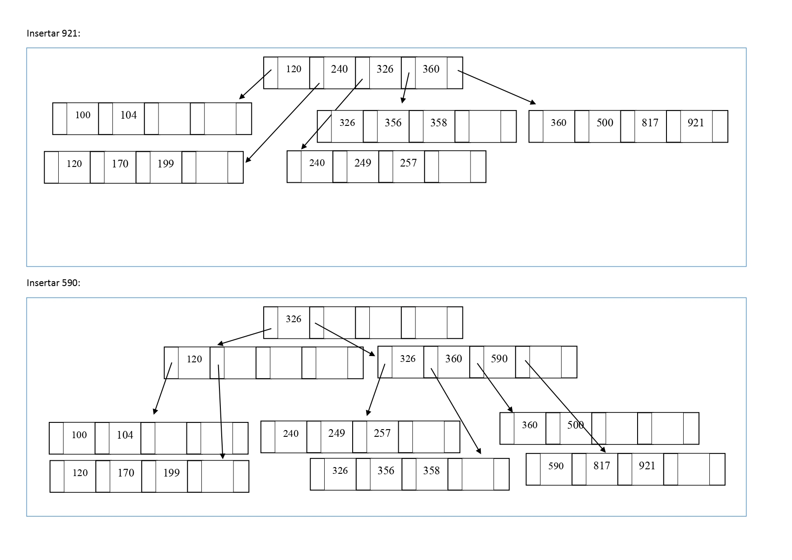
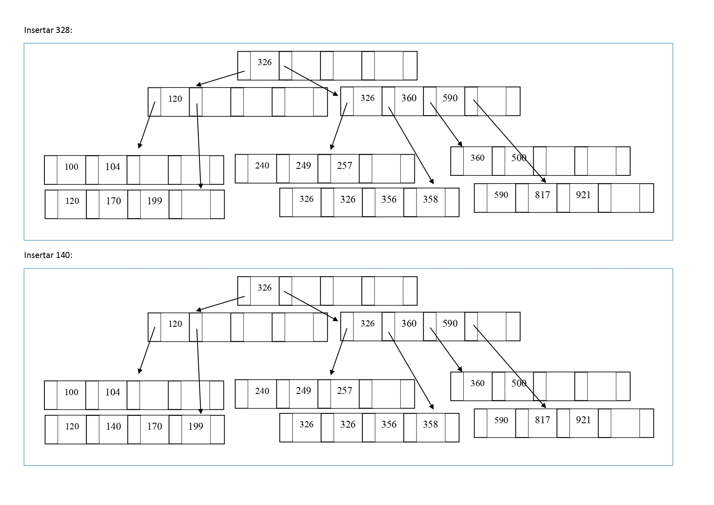

18.	Inserte los siguientes datos en un árbol-B+, de grado 2. 
Los números que se dan como datos pueden representar a datos más complejos (objetos). Dibuje el árbol a medida que sufra cambios en su estructura como consecuencia de la inserción.
Insertar: 
120 - 100 - 240 - 817 - 356 - 199 - 249 - 326 - 500 - 170 - 360 - 257 - 358 - 104 - 921 - 590 - 328 - 140

