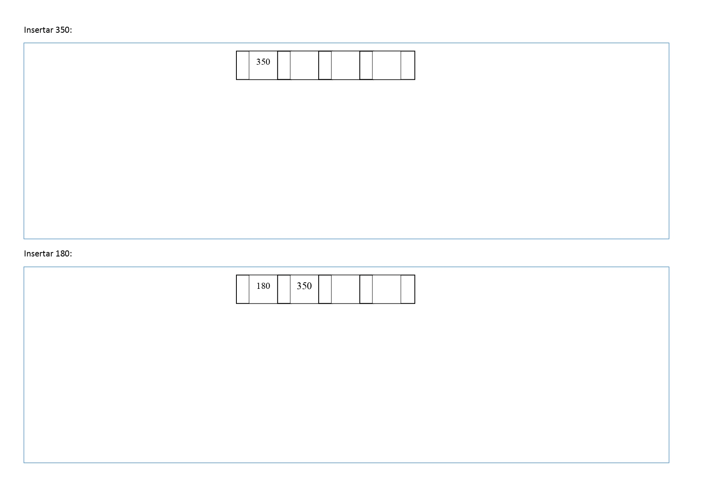
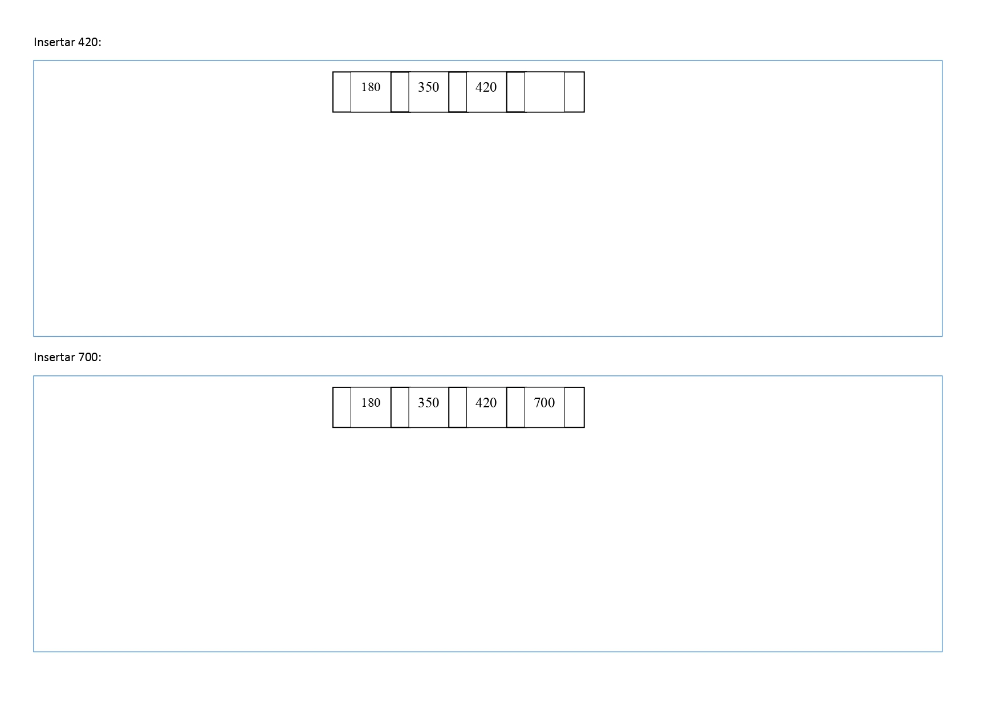
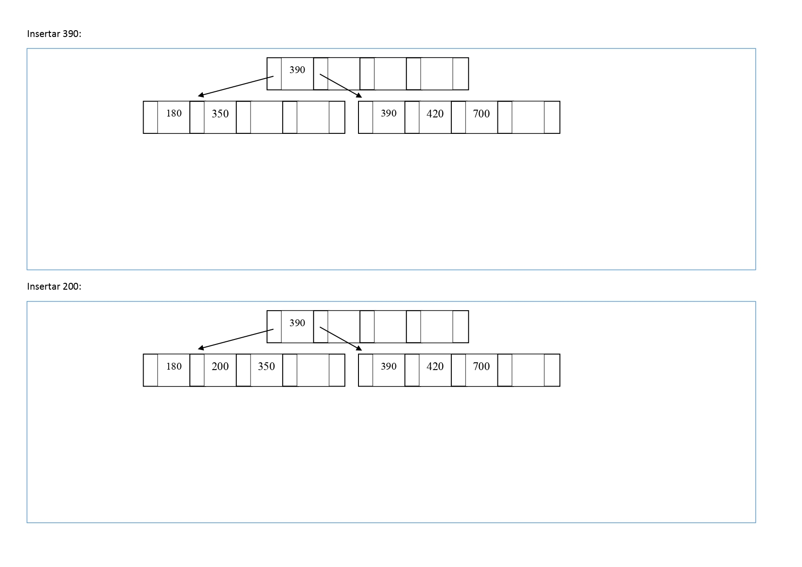
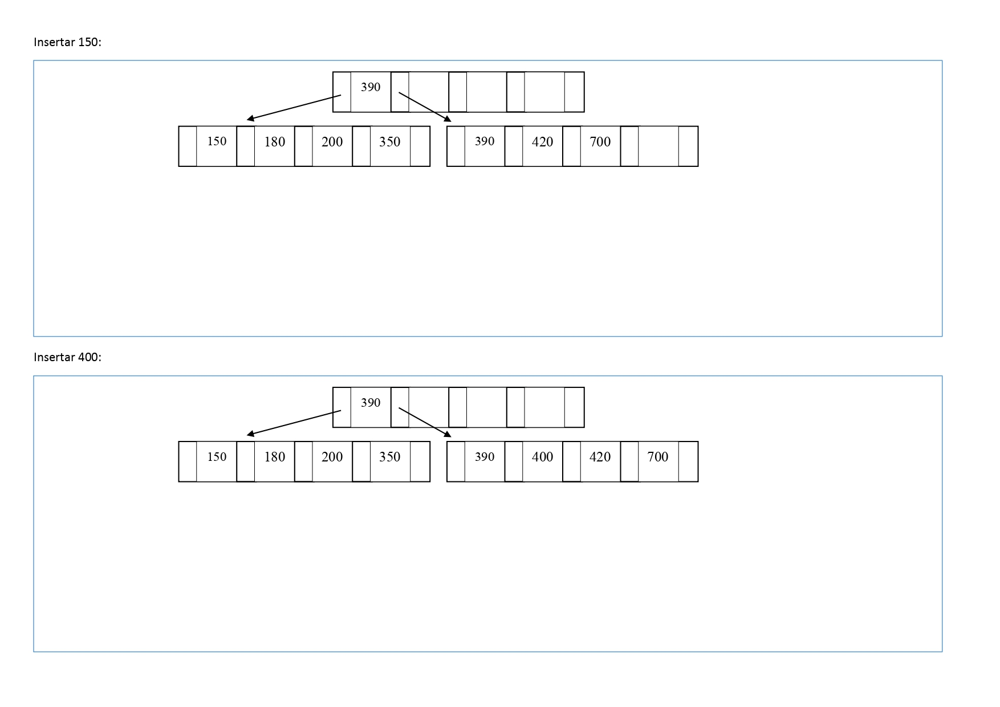
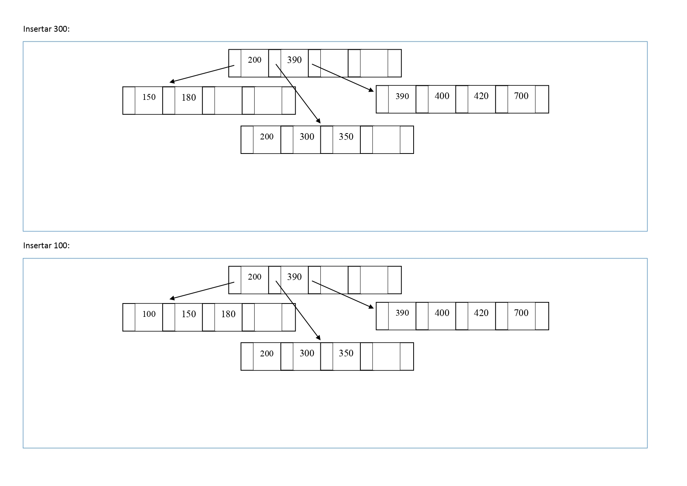
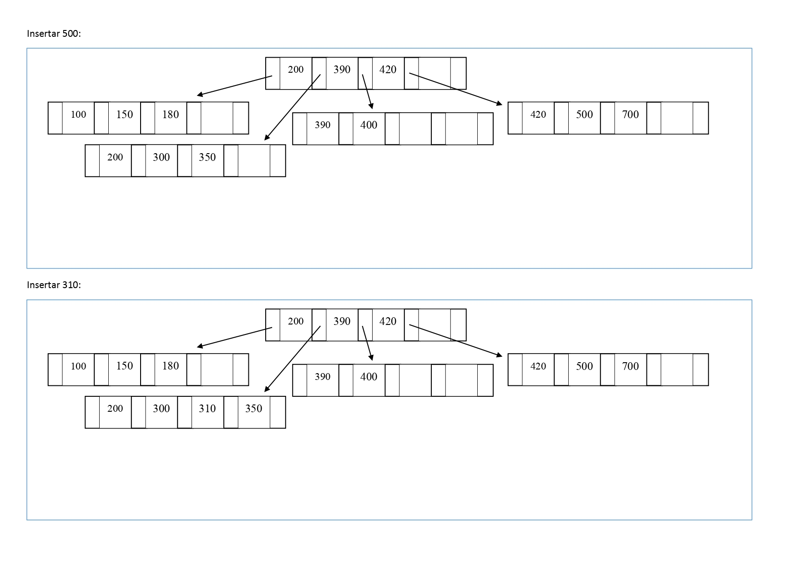
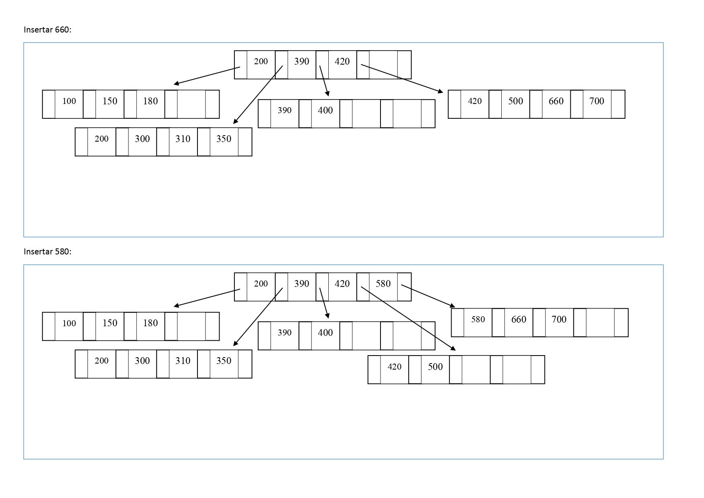
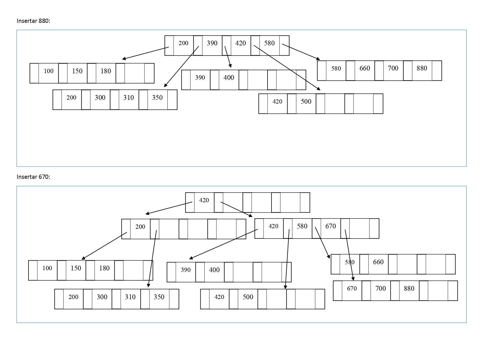
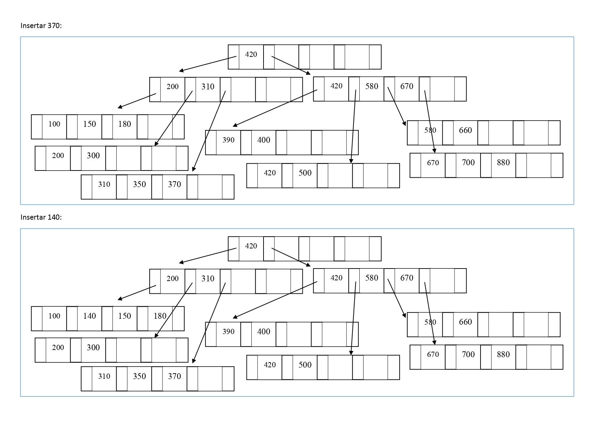
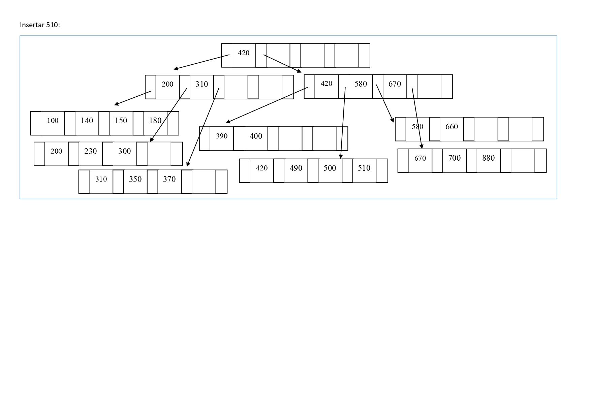

20.	Inserte los siguientes datos en un árbol-B+, de grado 2. 
Los números que se dan como datos pueden representar a datos más complejos (objetos). Dibuje el árbol a medida que sufra cambios en su estructura como consecuencia de la inserción.
Insertar: 
350 - 180 - 420 - 700 - 390 - 200 - 150 - 400 - 300 - 100 - 500 - 310 - 660 - 580 - 880 - 670 - 370 - 140 - 230 - 490 - 510

