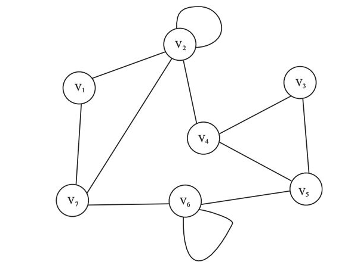

1.	Dada la siguiente gráfica, señale:
(a)	Un camino entre los vértices V1, y V5, si es posible.

V1 - V7 - V6 - V5

(b)	Un camino simple entre cada par de vértices, si es posible.

V1 - V2
V1 - V2 - V4 - V3
V1 - V2 - V4
V1 - V2 - V4 - V5
V1 - V7 - V6
V1 - V7
V2 - V4 - V3
V2 - V4
V2 - V4 - V5
V2 - V7 - V6
V2 - V7
V3 - V4
V3 - V5
V3 - V5 - V6
V3 - V5 - V6 - V7
V4 - V5
V4 - V5 - V6
V4 - V5 - V6 - V7
V5 - V6
V5 - V6 - V7
V6 - V7

(c)	El grado de cada vértice.

G(V1) = 2
G(V2) = 4
G(V3) = 2
G(V4) = 3
G(V5) = 3
G(V6) = 3
G(V7) = 3

(d)	Lazos o bucles, si existen.

Lazos en V2 y V6

