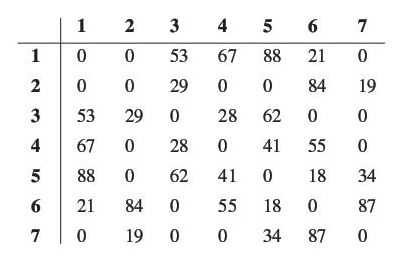
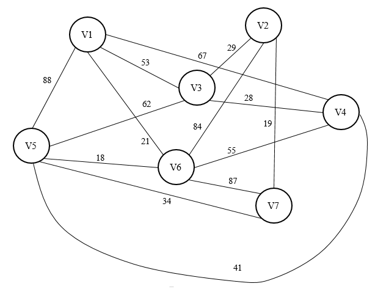

5.	Dada la siguiente matriz de adyacencias etiquetada, dibuje la gráfica no dirigida correspondiente. 
El 0 en la posición (i, j) indica que no existe un arco entre los vértices Vi y Vj, incluyendo a la diagonal principal.

Resultado:

